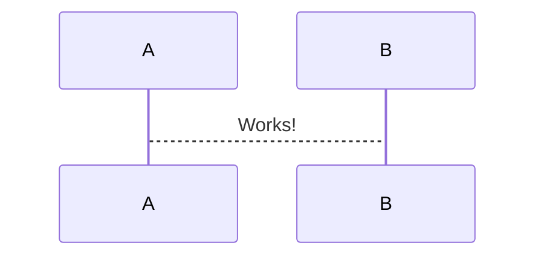

# MARKDOWN

## What this is

## BASIC SYNTAX

### document structure

````md
# TITLE

## LEVEL 2
### LEVEL 3
#### Level 4
````

### Create you Table of Content (TOC)
this can be done manually like that
````md
1. [ Description. ](#desc)
2. [ Usage tips. ](#usage)

<a name="desc"></a>
## 1. Description

sometext

<a name="usage"></a>
## 2. Usage tips

sometex
````

## links to ref
[markdown guide](https://about.gitlab.com/handbook/markdown-guide/)

## Images


### Extension
[MkDocs](https://mkdocs.readthedocs.io/en/stable/) is static website generator from markdown files. perfect for project documentation. it can be extended with plugins.


